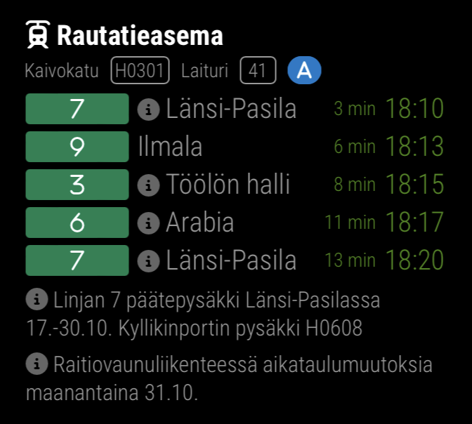
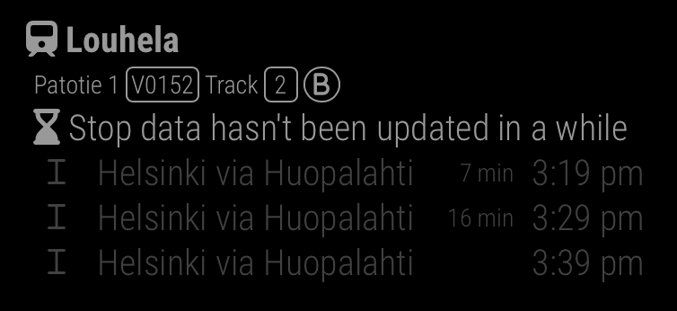

# Publika

HSL (Helsinki region, Finland) public transport schedule times module for MirrorMirror project


## What it does

The `publika` module shows public transport timetables from HSL (Helsinki region, Finland)

## Functionalities

- Can display several stops and/or stations based on configuration
- Displays stop code, platform/track and ticket zones
- Supports english, finnish and swedish
- Displays times in realtime when available
  - If not, displays the scheduled departure using the `~` symbol, like HSL does. 
- Displays cancelled trips
- Amount of stops to display can be configured for all stops or individually
- Displays disruptions (alerts) for services and stops/stations using different icons depending on severity
- Blinks when service departure time is less than one minute
- Can display one stop or the whole station
  - For example, one train station has at least two stops, aka tracks. Some bus stations has several platforms
- Can set a delay start to a stop
  - For example in the case the stop is a bit far, so services that start before the delay are not shown
- Stop and station IDs can be searched directly with the module

## Dependencies

- An installation of [MagicMirror<sup>2</sup>](http://magicmirror.builders/)
- DigiTransit (**required**, free): [https://digitransit.fi/en/developers/](https://digitransit.fi/en/developers/)
  - Used for fetching timetables and searching for stops and stations
  - Note: For now no API key is needed, but this would change in the future (april 2023)

## Other screenshots
- Single stop view:


- Search stop and station IDs from the module:


- Supports english, finnish and swedish:


- Stop with disruptions (alerts):



- Stop with cancelled trips:


- Show a warning when data hasn't been fetched in a while (For example when MagicMirror<sup>2</sup> is down):



## Getting started

1) Clone this repository under `MagicMirror/modules` folder
2) Add the module to the modules array in the `MagicMirror/config/config.js` file:

```js
{
  module: "publika",
  position: "top_right",
  header: "HSL schedule",
  config: {
    stops: [1000105],
    stopTimesCount: 5,
  }
}
```

### Configuration options

`config`:

| Option | Required | Type | Default | Description | Example |
| --- | --- | --- | --- | --- | --- |
| hslApiKey | no | `string` | `undefined` | API key for use of HSL DigiTransit API. It will be required starting from april 3rd, 2023 | `"abc123def456ghi789"` |
| stopTimesCount | no | `number` | `5` | Amount of stops for all stops | `3` |
| fullHeadsign | no | `boolean` | `false` | Show complete headsign for all stops. For example: Töölön halli via Kallio | `true` |
| headsignViaTo | no | `boolean` | `false` | Show headsign in the form via-destination for all stops. For example: Kallio - Töölön halli. Requires `fullHeadsign` to be `true` | `true` |
| stops | yes | `array<string \|  number \| StopObject>` | `undefined` | List of stops to display in the module | `[1020453]` |

`stops` can be an array of string, number, `StopObject` or a mix of them:
```js
{
  config: {
    stops: [
      "H0082",
      { id: 1000105, type: "station" },
      1020453,
    ]
  }
}
```

- A string represents a stop code to search for, or the stop name to search for
- A number represents the stop ID, which is needed for actually displaying stop data

`StopObject`:

| Option | Required | Type | Default | Description | Example |
| --- | --- | --- | --- | --- | --- |
| id | yes | `number` | `undefined` | ID of the stop or station | `1020453` |
| name | no | `string` | `undefined` | Name to display on the stop title, next to the stop name | `"To city center"` |
| type | no | `string` | `stop` | Only needed when using station, otherwise assumed to be a stop | `"station"` |
| minutesFrom | no | `number` | `undefined` | Only fetch services starting this amount of minutes from now | `3` |
| stopTimesCount | no | `number` | Same as parent `stopTimesCount` if set, otherwise `5` | Amount of stops for this particular stop | `7` |
| fullHeadsign | no | `boolean` | Same as parent `fullHeadsign` if set, otherwise `false` | Show complete headsign for this particular stop. For example: Lentoasema via Myyrmäki | `true` |
| headsignViaTo | no | `boolean` | Same as parent `headsignViaTo` if set, otherwise `false` | Show headsign in the form via-destination for this particular stop. For example: Myyrmäki - Lentoasema. Requires `fullHeadsign` to be `true` | `true` |
| disabled | no | `boolean` | `false` | If set to `true`, the module will not show nor fetch this stop | `false` |

## Glossary

| Term | Explanation |
| --- | --- |
| Station | A location, which contains stops. For example, a train station is a station and its platforms are stops. |
| Stop | A public transport stop, from which passengers can board vehicles. |
| Cluster | A list of stops, grouped by name and proximity. **Note that clusters are no longer available in this module** |
