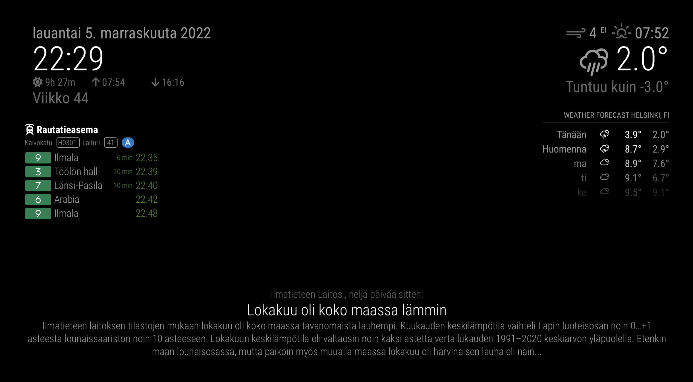

# Publika

Finland's public transport schedule times module for MirrorMirror project

- Normal view:


- Bar view:


## What it does

The `publika` module shows public transport timetables from Finland's cities

## Functionalities

- Can display several stops and/or stations based on configuration
- Displays stop code, platform/track and ticket zones
- Supports english, finnish and swedish
- Support multiple cities: Helsinki, Tampere, Turku among others. Check below to see [the full list](#supported-feeds).
- Displays times in realtime when available
- Displays cancelled trips
- Amount of stops to display can be configured for all stops or individually
- Displays disruptions (alerts) for services and stops/stations using different icons depending on severity
- Blinks when service departure time is less than one minute
- Can also display city bike stations
- Can display one stop or the whole station
  - For example, one train station has at least two stops, aka tracks. Some bus stations has several platforms
- Can set a delay start to a stop
  - For example in the case the stop is a bit far, so services that start before the delay are not shown
- Can set rules to show or hide stops
  - For example show only on weekdays between 15:00 and 16:00
- Stop and station IDs can be searched directly with the module
- Can be loaded multiple times in different positions or in the same

## Dependencies

- An installation of [MagicMirror<sup>2</sup>](http://magicmirror.builders/)
- DigiTransit (**required**, free): [https://digitransit.fi/en/developers/](https://digitransit.fi/en/developers/)
  - Used for fetching timetables and searching for stops and stations
  - Note: For now no API key is needed, but this would change in the future (april 2023)

## Other screenshots
- Single stop view:


- Search stop and station IDs from the module:


- Supports english, finnish and swedish:


- Stop with disruptions (alerts):


- Stop with cancelled trips:


- Station with platform:


- Bike station:


- Estimated time of arrival to a second station:


- Show a warning when data hasn't been fetched in a while (For example when MagicMirror<sup>2</sup> is down):


- The module can be loaded multiple times:


- Stop with no pickups:


All cities:


## Getting started

1) Clone this repository under `MagicMirror/modules` folder
2) Add the module to the modules array in the `MagicMirror/config/config.js` file:

```js
{
  module: "publika",
  position: "top_right",
  config: {
    feed: "HSL",
    stops: [1020453],
    stopTimesCount: 5,
  }
}
```

### Positions:

| Position | Supported | Type |
| --- | :---: | --- |
| top_bar | :white_check_mark: | Bar |
| top_left | :white_check_mark: | Normal |
| top_center | :white_check_mark: | Normal |
| top_right | :white_check_mark: | Normal |
| upper_third | :white_check_mark: | Bar |
| middle_center | :white_check_mark: | Bar |
| lower_third | :white_check_mark: | Bar |
| bottom_left | :white_check_mark: | Normal |
| bottom_center | :white_check_mark: | Normal |
| bottom_right | :white_check_mark: | Normal |
| bottom_bar | :white_check_mark: | Bar |
| fullscreen_above | :white_check_mark: | Bar |
| fullscreen_below | :white_check_mark: | Bar |

#### Position's screenshots:

- Top left (normal view):



- Top bar (bar view):


- Bottom bar (bar view):


- Fullscreen above/below (bar view):


### Supported feeds:

The following feeds are supported:

| Region | Name | Code | Documentation |
| --- | --- | --- | --- |
| Helsinki | HSL | HSL | [HSL](docs/HSL/README.md) |
| Hämeenlinna | Hämeenlinna | Hameenlinna | [Hameenlinna](docs/Hameenlinna/README.md) |
| Joensuu | JOJO | Joensuu | [Joensuu](docs/Joensuu/README.md) |
| Jyväskylä | Linkki | LINKKI | [Jyväskylä](docs/LINKKI/README.md) |
| Kajaani | Kajaani | Kajaani | [Kajaani](docs/Kajaani/README.md) |
| Kotka | Jonne & Minne | Kotka | [Kotka](docs/Kotka/README.md) |
| Kouvola | Koutsi | Kouvola | [Kouvola](docs/Kouvola/README.md) |
| Kuopio | Vilkku | Kuopio | [Kuopio](docs/Kuopio/README.md) |
| Lahti | Lahti | Lahti | [Lahti](docs/Lahti/README.md) |
| Lappeenranta | Jouko | Lappeenranta | [Lappeenranta](docs/Lappeenranta/README.md) |
| Mikkeli | Mikkeli | Mikkeli | [Mikkeli](docs/Mikkeli/README.md) |
| Tampere | Nysse | tampere | [tampere](docs/tampere/README.md) |
| Oulu | Oulu | OULU | [OULU](docs/OULU/README.md) |
| Rovaniemi | Linkkari | Rovaniemi | [Rovaniemi](docs/Rovaniemi/README.md) |
| Turku | Föli | FOLI | [FOLI](docs/FOLI/README.md) |
| Vaasa | Vaasa | Vaasa | [Vaasa](docs/Vaasa/README.md) |

### Configuration options

`config`:

| Option | Required | Type | Default | Description | Example |
| --- | --- | --- | --- | --- | --- |
| core | Required only when loading the module multiple times | `boolean` | `undefined` | When loading the module multiple times, one and only one instance has to be set up as core | `true` |
| feed | no | `string` | `"HSL"` | Specify the feed to use. Check [the feed list](#supported-feeds) | `"tampere"` |
| digiTransitApiKey | no | `string` | `undefined` | API key for use of DigiTransit API. It will be required starting from april 3rd, 2023. **Important**: If the module is loaded multiple times, this field has to be in the same instance that is set as core | `"abc123def456ghi789"` |
| stopTimesCount | no | `number` | `5` | Amount of stops for all stops | `3` |
| fullHeadsign | no | `boolean` | `false` | Show complete headsign for all stops. For example: Töölön halli via Kallio | `true` |
| headsignViaTo | no | `boolean` | `false` | Show headsign in the form via-destination for all stops. For example: Kallio - Töölön halli. Requires `fullHeadsign` to be `true` | `true` |
| theme | no | `string` | `"color"` | Color scheme to show. Default is `color` which uses feed color schemas. Option `mono` uses black and white | `mono` |
| stops | yes | `array<string \|  number \| StopObject>` | `undefined` | List of stops to display in the module | `[1020453]` |

`stops` can be an array of string, number, `StopObject` or a mix of them:
```js
{
  config: {
    feed: "HSL",
    stops: [
      { id: "Tove Jansson", search: "stop" },
      1020453,
      { id: 1000105, type: "station" },
      { id: 218, type: "bikeStation" },
      { id: 1291502, eta: 4610551 }
    ]
  }
}
```

- A number represents the stop ID, which is needed for actually displaying stop data

`StopObject`:

| Option | Required | Type | Default | Description | Example |
| --- | --- | --- | --- | --- | --- |
| id | yes | `number` | `undefined` | ID of the stop, station, or city bike station | `1020453` |
| name | no | `string` | `undefined` | Name to display on the stop title, next to the stop name | `"To city center"` |
| type | no | `string` | `"stop"` | Only needed when using station (`"station"`) or bike station (`"bikeStation"`), otherwise assumed to be a stop | `"station"` |
| search | no | `string` | `"stop"` | Type of search to perform. At this moment only stop search is supported | `"stop"` |
| minutesFrom | no | `number` | `undefined` | Only fetch services starting this amount of minutes from now | `3` |
| stopTimesCount | no | `number` | Same as parent `stopTimesCount` if set, otherwise `5` | Amount of stops for this particular stop | `7` |
| fullHeadsign | no | `boolean` | Same as parent `fullHeadsign` if set, otherwise `false` | Show complete headsign for this particular stop. For example: Lentoasema via Myyrmäki | `true` |
| headsignViaTo | no | `boolean` | Same as parent `headsignViaTo` if set, otherwise `false` | Show headsign in the form via-destination for this particular stop. For example: Myyrmäki - Lentoasema. Requires `fullHeadsign` to be `true` | `true` |
| rules | no | `array<StopRule>` | `undefined` | Set of rules for showing this stop/station | See below |
| eta | no | `number` | `undefined` | Estimated time of arrival to this stop. It has to be a stop and it has to be in the same direction. | `4610551` |
| disabled | no | `boolean` | `false` | If set to `true`, the module will not show nor fetch this stop | `false` |

`StopRule`:
| Option | Required | Type | Default | Description | Example |
| --- | --- | --- | --- | --- | --- |
| days | no | `array<number>` | `undefined` | Array of days that the stop/station will be shown. 0 is sunday, 1 is monday, 2 is tuesday, etc. | `[1, 4]` |
| startTime | no | `string` | `undefined` | Start time. Must be in 24H format, regardless of other configurations | `15:30` |
| endTime | no | `string` | `undefined` | End time. Must be in 24H format, regardless of other configurations | `16:15` |

Examples: 
```js
[
  {
    days: [1, 2, 3, 4, 5],
    startTime: "15:45",
    endTime: "16:45"
  },
  {
    days: [6, 0]
  }
]
```

## Glossary

| Term | Explanation |
| --- | --- |
| Station | A location, which contains stops. For example, a train station is a station and its platforms are stops. |
| Stop | A public transport stop, from which passengers can board vehicles. |
| Cluster | A list of stops, grouped by name and proximity. **Note that clusters are no longer available in this module** |
