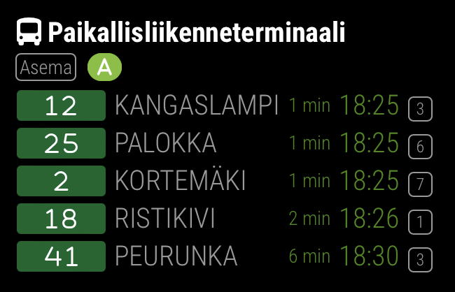

# Publika > LINKKI

Jyväskylä public transport schedule times module for MirrorMirror project



Quick config example:

```js
{
  module: "publika",
  position: "top_left",
  config: {
    feed: "LINKKI",
    stops: [{ id: 1, type: "station" }]
  }
}
```

Read the full specifications: [README.md](../../README.md#publika)
