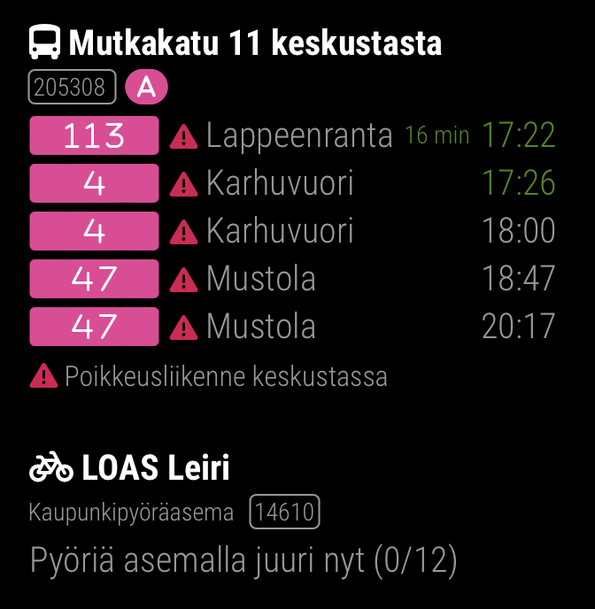

# Publika > Lappeenranta

Lappeenranta public transport schedule times module for MirrorMirror project



Quick config example:

```js
{
  module: "publika",
  position: "top_left",
  config: {
    feed: "Lappeenranta",
    stops: [366548]
  }
}
```

Read the full specifications: [README.md](../../README.md#publika)
