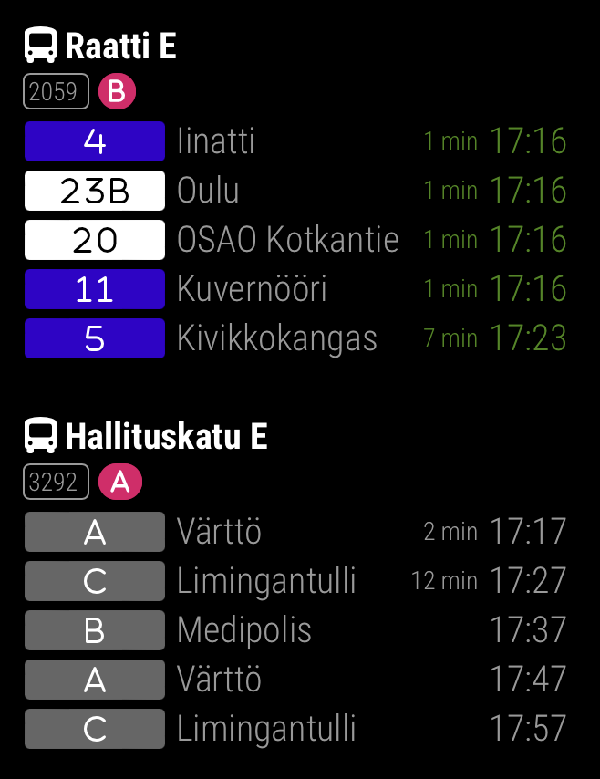

# Publika > OULU

Oulu public transport schedule times module for MirrorMirror project



Quick config example:

```js
{
  module: "publika",
  position: "top_left",
  config: {
    feed: "OULU",
    stops: [
      120799,
      184175
    ]
  }
}
```

Read the full specifications: [README.md](../../README.md#publika)
